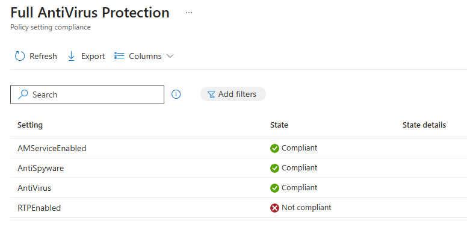
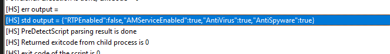

# 🛡️ Intune Custom Compliance Policies

This guide walks you through creating a **custom compliance policy** in Microsoft Intune.  

---

## ❓ Why Use a Custom Compliance Policy?

Sometimes default compliance policies report settings like **Microsoft Defender Antimalware** or **Real-Time Protection** as **Not Compliant**—even when a third-party antivirus is used.

Example:


**Why?**  
Third-party AV solutions may not register properly with Windows Security Center. That’s where a **Custom Compliance Policy** comes in.

---

## 🧩 What You’ll Need

To create a custom compliance policy, you need:

1. **PowerShell script** — Queries compliance info from the device.
2. **JSON file** — Defines what values should be considered compliant.

---

## 🧪 PowerShell Script Example

This example uses `Get-MpComputerStatus` to check Defender settings:

```powershell
# Get the Defender status values
$mpStatus = Get-MpComputerStatus
$RTPEnabled = $mpStatus.RealTimeProtectionEnabled
$AMServiceEnabled = $mpStatus.AMServiceEnabled
$AntiSpyware = $mpStatus.AntispywareEnabled
$AntiVirus = $mpStatus.AntivirusEnabled

# Build the output hashtable
$output = @{
    RTPEnabled      = $RTPEnabled
    AMServiceEnabled = $AMServiceEnabled
    AntiSpyware     = $AntiSpyware
    AntiVirus       = $AntiVirus
}

# Convert to compressed JSON
return $output | ConvertTo-Json -Compress
```

### Breakdown
1. **Collects data** via PowerShell.
2. **Outputs values** into JSON format.
3. These values match the **SettingName** fields in your JSON file.

---

## 📄 JSON File Sample

Here’s a simplified version of `AntiVirusCheck.json`:

```json
{
  "Rules": [
    {
      "ruleType": "script",
      "SettingName": "RTPEnabled",
      "Operator": "IsEquals",
      "Operand": "true",
      "DataType": "Boolean",
      "MoreInfoUrl": "https://google.com",
      "RemediationStrings": [
        {
          "Language": "en_US",
          "Title": "This machine has no active RealtimeProtection.",
          "Description": "To continue to use this device you have to activate RealtimeProtection"
        }
      ]
    }
  ]
}
```

### JSON Explanation
- `ruleType`: Use `"script"` when value comes from PowerShell.
- `SettingName`: Matches key from PowerShell output.
- `Operator`: Logical check (e.g., `IsEquals`).
- `Operand`: Expected value (e.g., `"true"`).
- `DataType`: Should match the actual value type.
- `RemediationStrings`: Message shown to user, localized by language.

---

## 🧭 Steps to Create the Policy in Intune

### Step 1: Sign in to Microsoft Endpoint Manager

1. Go to [Microsoft Endpoint Manager](https://endpoint.microsoft.com/).
2. Sign in with your admin credentials.

---

### Step 2: Add PowerShell Script

1. Go to **Devices** > **Compliance Policies**.
2. Click on the **Scripts** tab.
3. Click **Add** > **Windows 10 and later**.


4. Name the script and paste in your PowerShell code.


5. Click **Create**.


---

### Step 3: Create the Compliance Policy

1. Back under **Policies**, click **Create Policy**.


2. Expand **Custom Compliance**, set it to **Required**.
3. Select the PowerShell script you added earlier.


4. Browse and attach your JSON file.


5. Click through **Next** twice, assign the policy to a group, and click **Create**.


---

## 📊 Step 4: Monitor Compliance

1. Go to **Devices** > **Monitor** > **Compliance policies**.
2. Review the compliance state for each device.

---

## 🔍 Extra: Troubleshooting and Logs

After assignment:

- Navigate to the device in Intune and view compliance state.
- Check local logs on the device at:

```text
C:\ProgramData\Microsoft\IntuneManagementExtension\Logs\HealthScripts.log
```

Use a viewer like **CMTrace** to analyze.




---

## 🎯 Final Thoughts

Creating a custom compliance policy can be tedious at first—but once understood, it’s **incredibly powerful**. You can enforce nearly any condition you can script in PowerShell.

> It’s only limited by your imagination. Have fun out there.