# Intune Custom Compliance Policies

Below you will find the basic steps for creating  a custom compliance policy. Its pretty basic how to do it, but you may ask, Why would I need one? Good question. In the following example we have created a standard policy but for some reason the Microsoft Defender Antimalware and also the Real-time protection is showing up as Not compliant. 

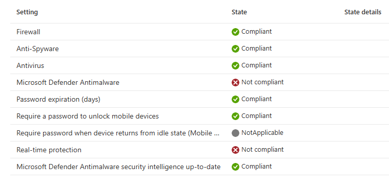

Why is that? In this environment we are using a third party anti virus and so its not registering correctly. How do we address this? Custom Compliance Policy. 

In this repo you will find some examples. You will need 2 items. 

1. JSON File, used to define the variables that will be checked for and displayed in Custom Compliance
2. PowerShell script that will be used to query that device

Once you have those files it is pretty easy. I do want to talk about those files

1. PowerShell
    - In the following example I am using the PowerShell command Get-MpComputerStatus to pull if 
        - Realtime-protection is enabled
        - Anti Malware is enabled
        - Anti Spyware is enabled
        - Anti Virus is enabled

There are many different methods to pull this information, you can pull it from a file, or folder or registry key. What ever method you can use with PowerShell to pull that information and then put that information into a readable JSON format.

```
# Get the Defender status values
$mpStatus = Get-MpComputerStatus
$RTPEnabled = $mpStatus.RealTimeProtectionEnabled
$AMServiceEnabled = $mpStatus.AMServiceEnabled
$AntiSpyware = $mpStatus.AntispywareEnabled
$AntiVirus = $mpStatus.AntivirusEnabled

# Build the output hashtable
$output = @{
    RTPEnabled      = $RTPEnabled
    AMServiceEnabled = $AMServiceEnabled
    AntiSpyware     = $AntiSpyware
    AntiVirus       = $AntiVirus
}

# Convert to compressed JSON
return $output | ConvertTo-Json -Compress

```
From a script breakdown 
1. First block is creating the variables to be used and what command to be used
2. Second block is creating the output based on the commands ran and also these same variables will be used in the JSON and will be what is displayed when you are looking at the compliance results in Intune
3. To me, almost the most important, this is out-putting the commands and the variables to a readable JSON format.

Now you have your PowerShell script created its time for the JSON

I will be totally honest. I am not a JSON person and I used ChatGPT to assist this with me. That got me almost there but I still had many hours to look at the output of the JSON and figure out what was really needed. This is a partial of the full JSON file called AntiVirusCheck.json located in the repo. I want to break down the sections. Once I figured out the sections, it really made it easier for me to work with. 

```
{
    "Rules": [
      {
        "ruleType": "script",
        "SettingName": "RTPEnabled",
        "Operator": "IsEquals",
        "Operand": "true",
        "DataType": "Boolean",
        "MoreInfoUrl": "https://google.com",
        "RemediationStrings": [
          {
            "Language": "en_US",
            "Title": "This machine has no active RealtimeProtection.",
            "Description": "To continue to use this device you have to activate RealtimeProtection"
          }
        ]
      }
    ]
}

  ```

- ruleType = Important is the rule type since we are using a script to pull the information I put in script
- SettingName = This is equal to the name that you put in the PowerShell script and will also be displayed in the compliance report
- Operator = This is to set what we are looking for. There are other values that can be used
- Operand = We are looking for a true value here so that is what that is used for
- DataType = Since we are doing JSON this is the value type that is needed
- MoreInfoURL = Can be used to direct users to the correct website or what ever they need to do. I left pretty generic for now
- RemediationStrings = This area is kind of interesting, You can even put multiple languages in here depending on your use case
    - Language = en_US
    - Title = gives a title to the message
    - Description = gives the message to the user if you have it setup to

So pretty easy once you understand what you need. There are other variables that can be used within the JSON, but I kept it to this. 

Once you have your PowerShell and JSON file its time to apply the policy. Lets start creating one

Follow these steps to create a custom compliance policy in Microsoft Intune:

## Step 1: Sign in to Microsoft Endpoint Manager Admin Center
1. Open a web browser and go to [Microsoft Endpoint Manager Admin Center](https://endpoint.microsoft.com/).
2. Sign in with your administrator credentials.

## Step 2: Navigate to Compliance Policies
1. In the left-hand navigation pane, select **Devices**.
2. Under **Manage Devices**, select **Compliance**.

## Step 3: Click on the Scripts tab
1. This section is where you import your PowerShell script

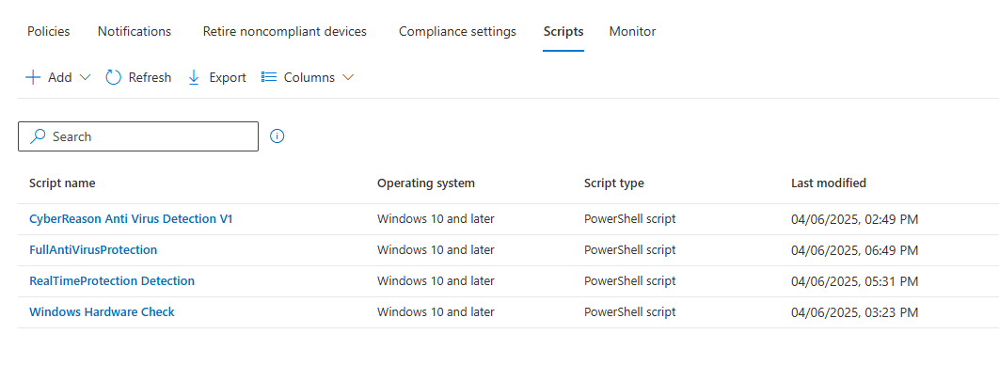

2. Click Add and select Windows 10 and later

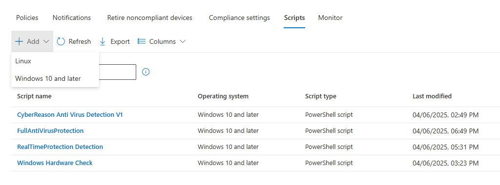

3. Give the script and name fill in what ever else you want and click next

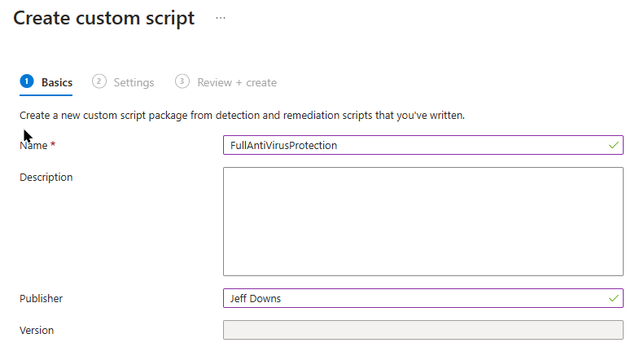

4. Paste in the script and leave the rest of the boxes as it and click next

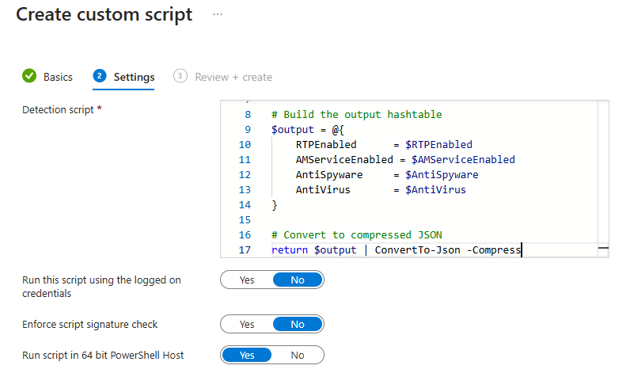

5. Click Create

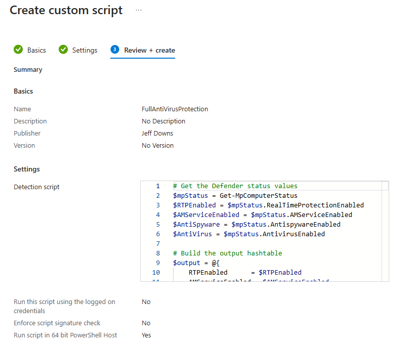

## Step 4: Click back on the Policies Tab

1. Click on Create Policy


2. Select the platform and click create

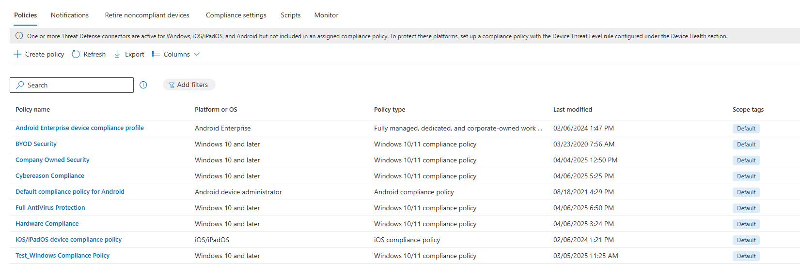

3. Fill in the information

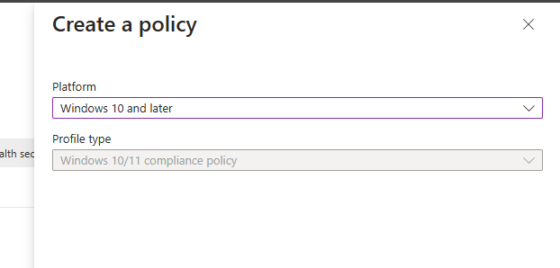

4. Expand the Custom Compliance section and slide it over to required

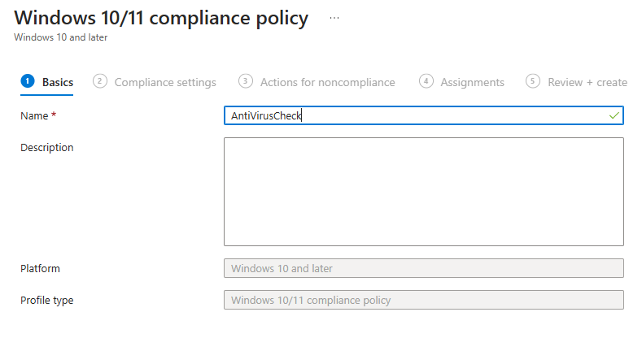

5. Select the PowerShell script and click select

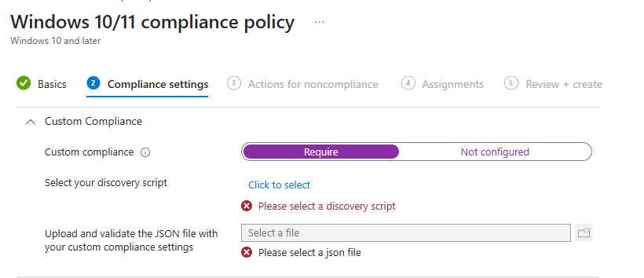

6. Click on the folder to browse to your JSON file

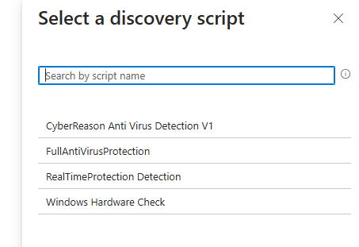

7. At this point if you have the correct JSON file and the script your screen should look like this. **Please note that all the fields that you created are displayed with their expected values**

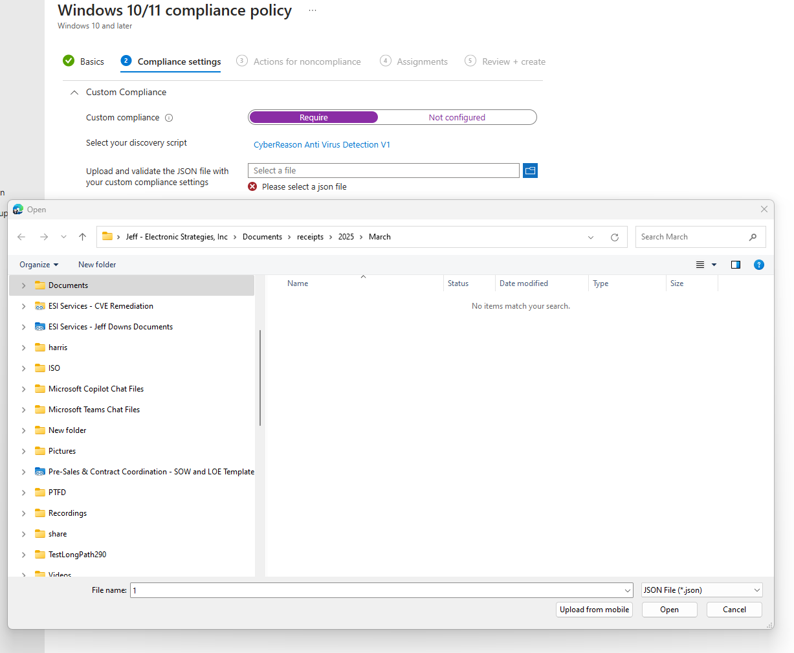

8. Click Next

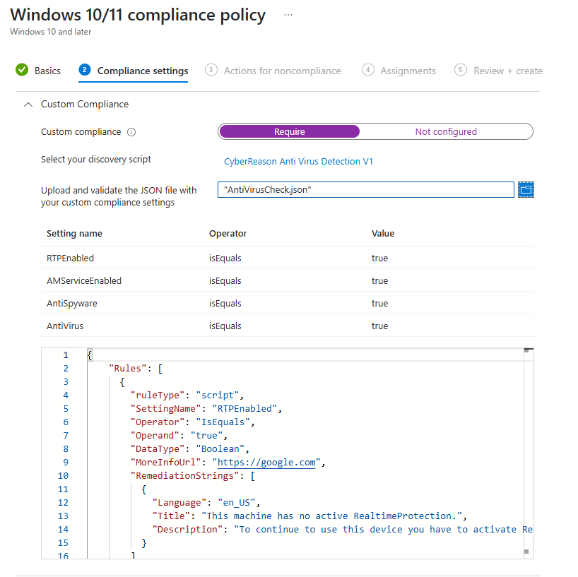

9. Click Next again

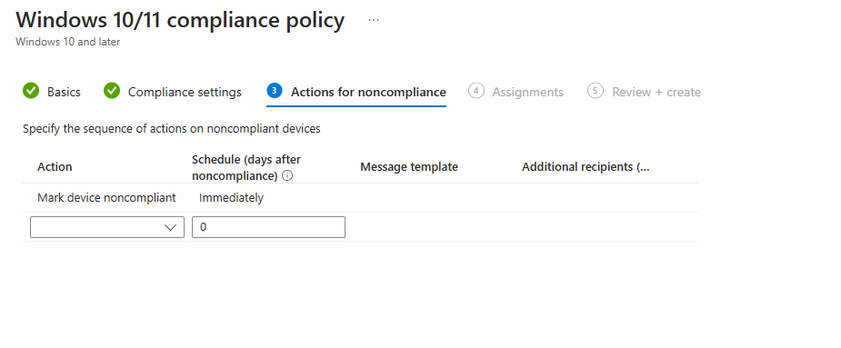

10. Add the assignments to the correct group and click next

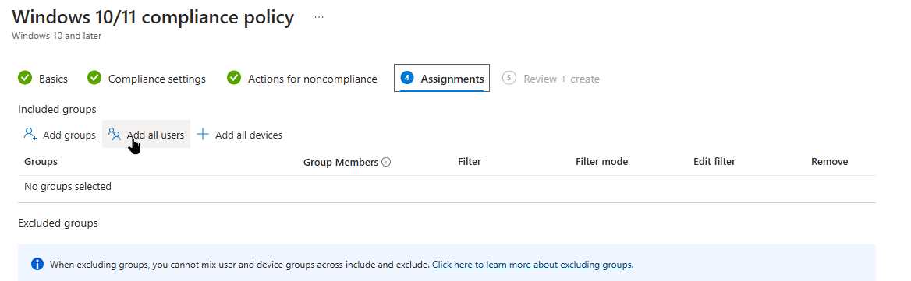

11. Click Create

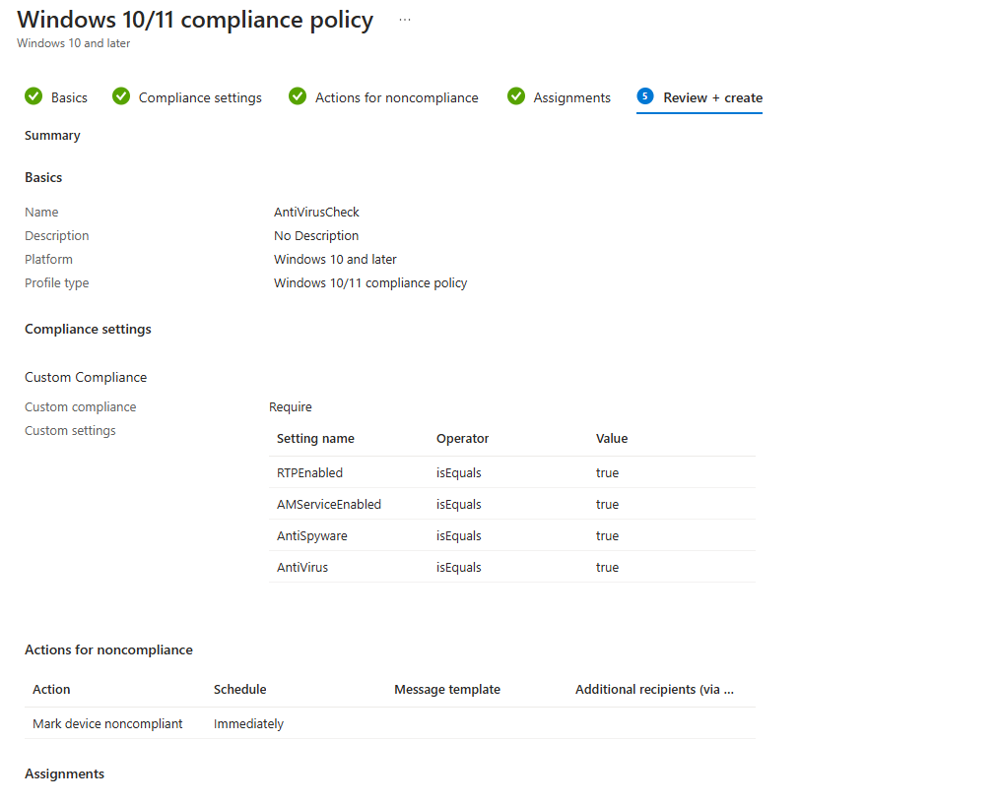

## Step 5: Monitor Compliance
1. After the policy is deployed, monitor compliance status under **Devices > Monitor > Compliance policies**.


You have successfully created a custom compliance policy in Intune!

