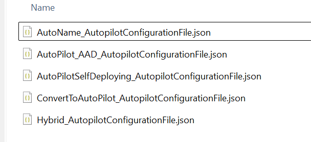

# Assign AutoPilot Profiles during imaging process

1. Import required powershell modules
```
Install-Module AzureAD -Force
Install-Module WindowsAutopilotIntune -Force
Install-Module Microsoft.Graph.Intune -Force 
```
2. Log onto Graph
```
Connect-MGGraph
```
3. Fireup Powershell ISE and run the following script
```
$AutopilotProfiles = Get-AutopilotProfile

Foreach ($AutopilotProfile in $AutopilotProfiles) {

    $TempPath = "C:\DATA\AutopilotProfiles\"

    if (!(Test-Path $TempPath)) {
        New-Item -Path $TempPath -ItemType Directory -Force
    }

    $name = $AutopilotProfile.displayName
    $ExportPath = $TempPath + $name + "_AutopilotConfigurationFile.json"
    $AutopilotProfile | ConvertTo-AutopilotConfigurationJSON | Out-File $ExportPath -Encoding ASCII

}  
```
4. Your Files will be downloaded the directory



5. 