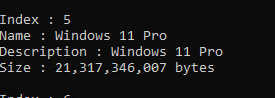
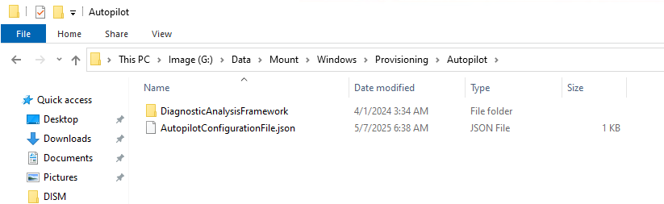

# Assign AutoPilot Profiles during imaging process

1. Import required powershell modules
```
Install-Module AzureAD -Force
Install-Module WindowsAutopilotIntune -Force
Install-Module Microsoft.Graph.Intune -Force 
```
2. Log onto Graph
```
Connect-MGGraph
```
3. Fireup Powershell ISE and run the following script
```
$AutopilotProfiles = Get-AutopilotProfile

Foreach ($AutopilotProfile in $AutopilotProfiles) {

    $TempPath = "C:\DATA\AutopilotProfiles\"

    if (!(Test-Path $TempPath)) {
        New-Item -Path $TempPath -ItemType Directory -Force
    }

    $name = $AutopilotProfile.displayName
    $ExportPath = $TempPath + $name + "_AutopilotConfigurationFile.json"
    $AutopilotProfile | ConvertTo-AutopilotConfigurationJSON | Out-File $ExportPath -Encoding ASCII

}  
```
4. Your Files will be downloaded the directory


5. Rename the profile you want to apply as the following:
    - AutopilotConfigurationFile.json

## The next section is all about DISM and how to do some DISM commands. In my own environement I have most of this done already but the only item I had to do was to mount the image
## I wanted. I will include the rest of the process based on the source material. 

6. You will need to download an ISO of Windows 11

7. Next you will need to get the index number for what version you want to deploy. In my example I want to get PRO.

```
Dism /get-wiminfo /wimfile:"E:\sources\install.wim"
```

8. Next Export the installer you want using the following command
```
Dism /export-image /SourceImageFile:"E:\sources\install.wim" /SourceIndex:6 /DestinationImageFile:C:\DATA\WIM\install.wim /Compress:max /CheckIntegrity
```

9. Mount the WIM
```
Dism /mount-wim /wimfile:"C:\DATA\WIM\install.wim" /index:1 /mountdir:C:\DATA\Mount 
```

10. Copy the .JSON file to the the following directory G:\DATA\Mount\Windows\Provisioning\Autopilot\


11. Commit the mounted image. ***Its important to close out all the folders where its mounted before you run this command or it will fail***
```
Dism /Commit-Image /MountDir:C:\DATA\Mount 
```
