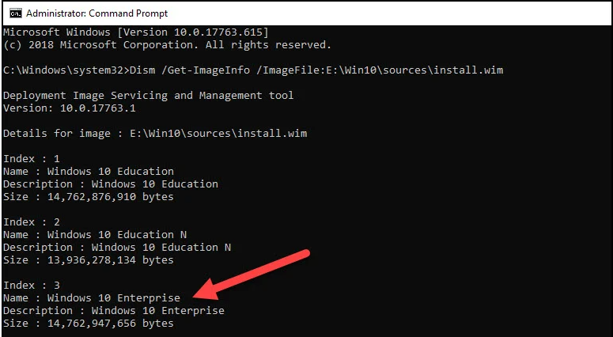

# Updating Image

One of the major task to any imaging solution is the process to keep the image up to date, so after you image  you are still doing updates. 
My professional opionion is not to do all the updates but stick more with the cumulative updates and what really needs to be updated. The two we are going to focus on

- March 27, 2025-KB5054979 Cumulative Update for .NET Framework 3.5 and 4.8.1 for Windows 11, version 24H2
- June 10, 2025—KB5060842 (OS Build 26100.4349)

These two are the ones that are always getting updated. Others are there but they do not seem to take as long and are more frequent on updates

1. Mount your WIM. In order to do this you will need to run the following command. First you might need to know which image version you are going to deploy
```
Dism /Get-ImageInfo /ImageFile:path to install.wim file
```


2. Now you know which image we will do. For this example we will be updating the Enterprise WIM or Index 3
```
DISM /mount-wim /wimfile:"path to .wim file" /index:3 /mountdir:"path to mount dir"
```


3. Run the following command to add the package
```
Dism /Add-Package /Image:"path to mount dir" /PackagePath="path to .msu file" /LogPath=log the output to a file
```


## Note:***In the event you have more than 1 update. You could also run the following commmands to do multiple ones***
```
Dism /Add-Package /Image:"mount dir" /PackagePath="updates folder\cu1.msu" /PackagePath="updates folder\cu2.msu" /PackagePath="updates folder\cu3.msu" /LogPath=log the output to a file
```

4. Commit the image
```
dism.exe /Unmount-wim /mountdir:"E:\Mount" /commit`
```

