# Intune MSI Application Deployment

## Purpose of this document is to provide guidance on how to deploy MSI based applications with Intune

1. Download the MSI Application ***For this example we will be using Google Chrome Enterprise Download***

    - [Google Chrome Enterprise Download](https://chromeenterprise.google/download/?utm_source=bing&utm_medium=cpc&utm_campaign=2025-q2-chromebrowser-paidmed-paiddisplay-other-chromebrowserent&utm_term=downloadnow-chrome-browser-enterprise-download&utm_content=GCPF&brand=GCPF&gclid=ca894196819113e8479929b98aa09cde&gclsrc=3p.ds&msclkid=ca894196819113e8479929b98aa09cde)

2. Download the Intune Win32 Prep Tool
    - [Intune Win32 Prep Tool](https://github.com/Microsoft/Microsoft-Win32-Content-Prep-Tool)

3. Once you download the prep tool and the MSI some place build the following file structure
```
    c:\apps
    C:\apps\Chrome
    C:\apps\Chrome\Output
```
4. Copy the Intune Win32 Prep Tool to ***c:\apps***

5. Copy the Google Chrome msi file to ***c:\apps\Chrome***

6. Launch Intune Win32 Prep Tool 

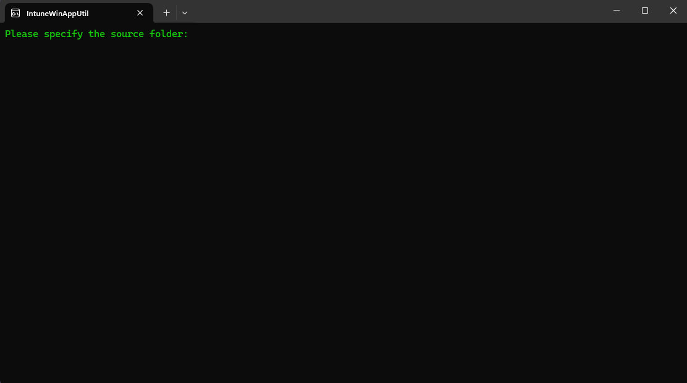

7. Once you are at this screen either copy and paste from the folder view of the file or type it in, which ever is easier for you. Once you do press enter

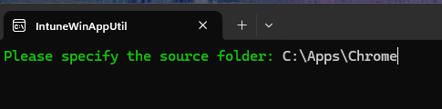

8. Next specifiy the name of the file and press enter

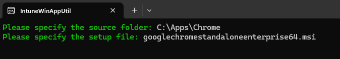

9. Next specify the name of the output folder. ***quick tip: Just up arrow 2 times and the source path will come up and then just type in \Output**
Press enter

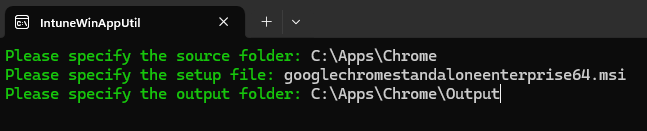

10. Click N and press enter

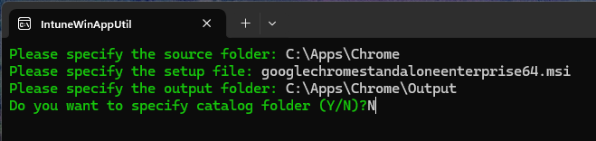

11. It will start to process once it is done, it will just close out

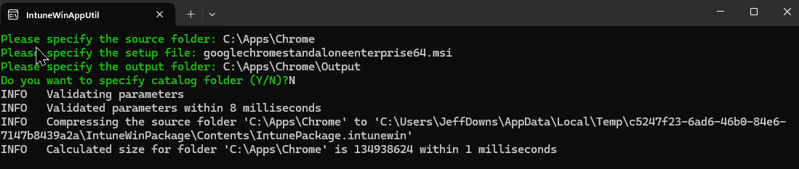

12. Next check to verify in the ***c:\apps\chrome\output*** folder you see the file

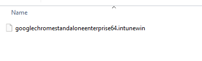

## Now you have all you need to create the deployment for Intune, lets head to the console

13. Goto Apps > Windows > Create

14. Select App Type > Windows app (Win32)

15. Click on Select app package file and browse to the location of the file that was created
    ```
    c:\apps\chrome\output\googlechromestandaloneenterprise64.intunewin
    ```

16. Once you do that your screen will look like the following. The only mandatory field that you have to fill in, is the Publisher. 
I just normally put in the name of the software company. Click NEXT

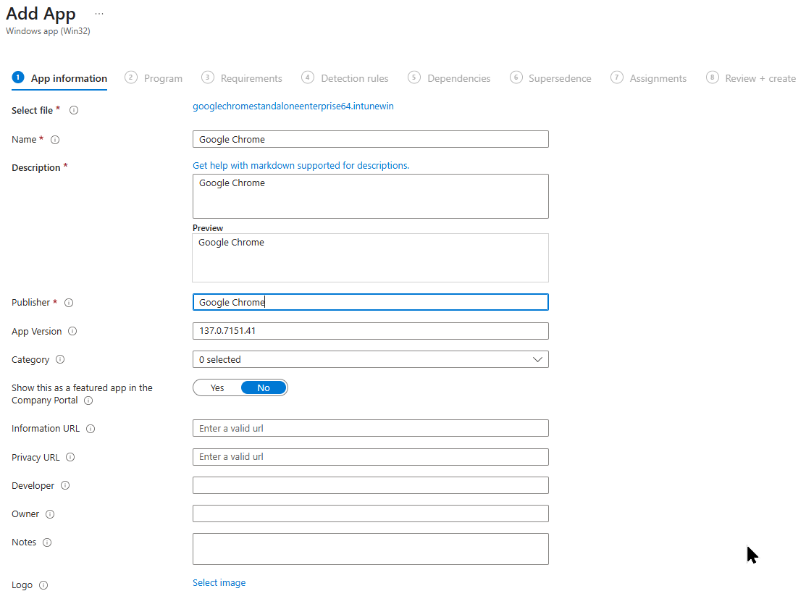

17. You can just click next on this screen.
    - ## Note:
        ***A benefit of MSI's is the fact it will automatically put in the install and uninstall strings for you. Which is nice.***

        ***You can add additional switches to the install if need be. Some applications have them that aids in the install of the application***

        ***Refer to software documentation for those switches***

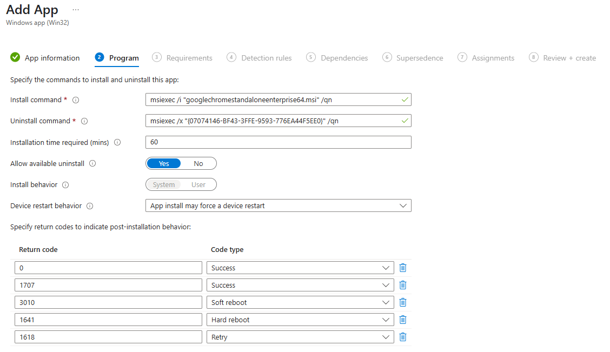

18. The first 2 fields are mandatory. 
    - ## Note:
        ***These are handy if you want to only distribute the software to specific specs of devices***

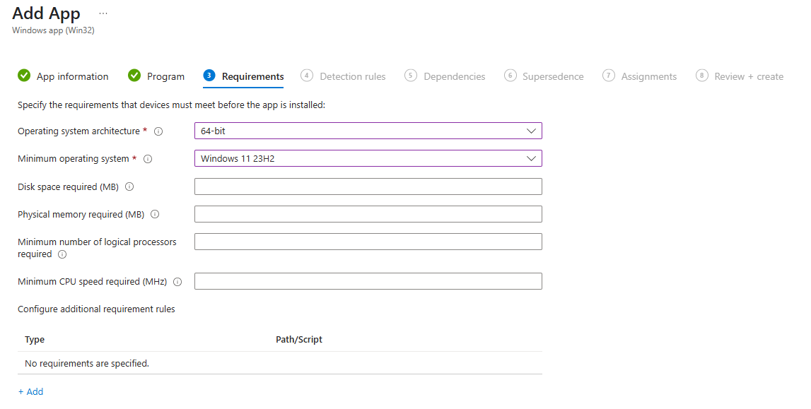

19. Next are the detecion Rules. MSI are really easy but there are other was to detect. What a detection script does is after the install it will look at this rule and this helps Intune verify if the application installed or not. If it fails the software may have installed but this just does not allow Intune to verify if it installed or not.

    - Under Rules formate click on Manually configure detection script and click add

    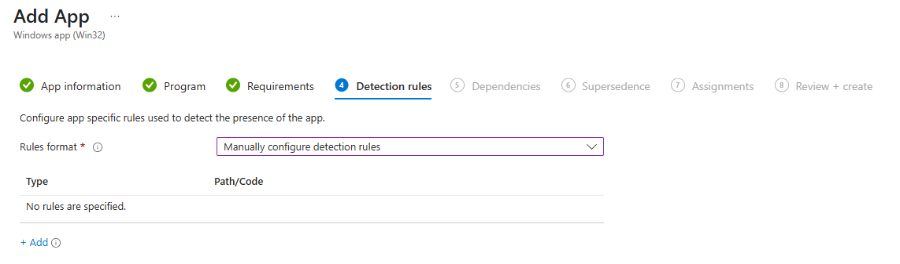

    - A side window will pop up on the far right and on the drop down just use MSI. Click OK
    ***Note:There are other options also MSI, File, Registry***

    ***Note:You can add multiple detection rules in the same deployment.***
    
    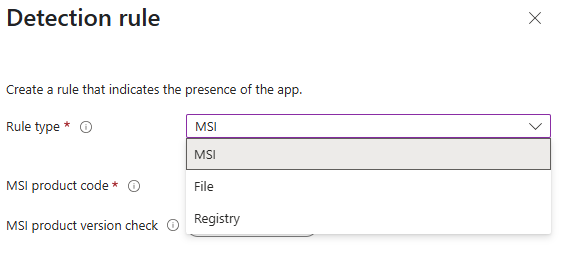

    - Click Next

    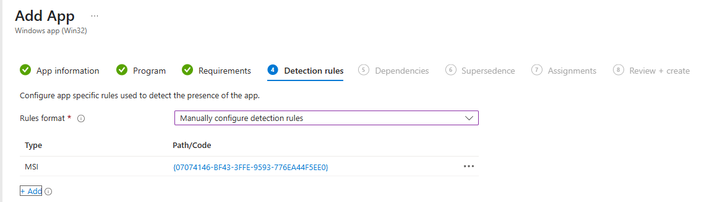

20. Next is Dependencies 
### ***Note:Dependencies are great. They will help you if something else needs to be installed before this gets installed.***

### ***Just click add and then select the program or dependencey that is needed and keep the slider on for Automatically install***

### ***For this install there are none, click Next***

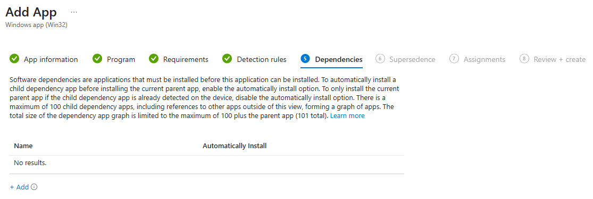

21. Next is Supersendence
### ***Note: Supersendenc is used for updating from a previous version. In order to do this just click on Add find the previous version and make the sure the slider says Yes for Uninstall previous version***

### ***For this example we do not have an older version just click NEXT

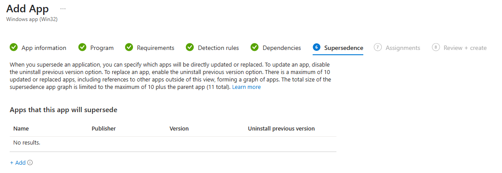

22. Assignments, Assign to the group you want and click next

23. Click Create

## Now you have deployed Chrome Enterprise to all your desktops. EXE are basically the same but there are some other items to take into count.

# EXE Something to think about
1. You must know the silent install switches, EXE are not filled in like the MSI does
2. Would be a good idea to install the application on a device and record the location of where its installed so you can manually make your own detection path using files or folder