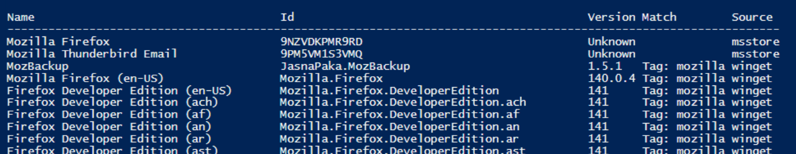
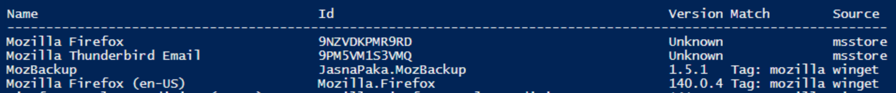
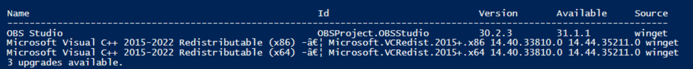

# Winget to Install applications in Intune

## In the following folders you will find examples of how you can install and detect applications via Winget. 

## The basic script used as part of detection script

```
# Search both HKLM and HKCU for all uninstall keys
$paths = @(
    "HKLM:\SOFTWARE\Microsoft\Windows\CurrentVersion\Uninstall\*",
    "HKLM:\SOFTWARE\WOW6432Node\Microsoft\Windows\CurrentVersion\Uninstall\*",
    "HKCU:\SOFTWARE\Microsoft\Windows\CurrentVersion\Uninstall\*"
)

$application = "*Mozilla Firefox*"

foreach ($path in $paths) {
    Get-ItemProperty $path -ErrorAction SilentlyContinue |
    Where-Object { $_.DisplayName -like $application } |
    Select-Object DisplayName, DisplayVersion, Publisher, InstallLocation
}
```

## Winget Commands

### Search for applications
```
winget search "Mozilla"
```


### Uninstall Application
```
winget uninstall --silent  "Mozilla"
```

### Install Application
***Note:When installing the application it is best to be specific on which version you want to install. You will get this information when you search***
***Note:You can either install via name or via ID***



### Via Name
```
winget install "Mozilla Firefox (en-US)" --silent --accept-package-agreements --accept-source-agreements
```
### Via ID

```
winget install "Mozilla.Firefox" --silent --accept-package-agreements --accept-source-agreements
```

### Seach installed applications that can be updated
```
winget update
```


### Install Application
```
