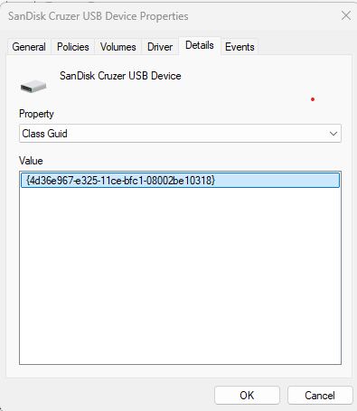

# ✅ Allow Specific USB Thumb Drives While Blocking All Others

## 1. Gather USB Device Information

1. Plug in your USB thumb drive.
2. Open **Device Manager**.
3. Expand **Disk Drives**.
4. Right-click on the thumb drive and select **Properties**.
5. Go to the **Details** tab.
6. In the dropdown, select **Hardware Ids**.
    - Copy the **first line** and save it somewhere (e.g., Notepad).


7. In the same dropdown, select **Class Guid**.
    > **Note:** All USB thumb drives typically share the same Class Guid. You only need to capture this once.

    - Copy the full line and save it as well.



---

## 2. Create Intune Policy to Allow Specific USB Devices

1. Open the **Microsoft Intune** portal.
2. Go to **Devices > Windows > Configuration Profiles** and click **Create Policy**.
3. Choose the following:
    - **Platform:** Windows 10 and later
    - **Profile Type:** Settings Catalog
    - **Name:** `Allow USB Drives`
    - **Description:** `Policy to enable use of specific USB drives while blocking all others`
4. Click **Create**.
5. Click **Add Settings**.
6. Search for and add the following settings:
    - ✅ **Allow installation of devices that match any of these device IDs**
    - ✅ **Apply layered order of evaluation for Allow and Prevent device installation policies across all device match criteria**
    - ✅ **Prevent installation of devices using drivers that match these device setup classes**

> **Important:**  
> The "Prevent installation..." setting may sound like it blocks the devices, but when used together with the layered evaluation and specific allow list, **it does not block allowed devices**.

---

## 3. Configure the Policy

1. Enter the previously gathered **Hardware ID** under the *Allow installation...* section:
    ```text
    USBSTOR\DiskSanDisk_Cruzer_Blade____2.01
    ```

2. Enter the **Class Guid** under the *Prevent installation...* section:
    ```text
    {36FC9E60-C465-11CF-8056-444553540000}
    ```

> **Important:**  
> Enable **all three** settings.  
> Also ensure you set **"Also apply to matching devices that are already installed"** to `True`.


---

## 4. Finalize and Assign the Policy

1. Click **Next** to skip Scope Tags (unless needed).
2. Assign the policy to the appropriate device group.
3. Click **Create**.

---

## 5. Resulting Policy Example

Your completed policy with two allowed USB devices may look like this:


## Bonus Content

I found this additional setting that can also be part of your solution. 

**Allow administrators to override Device Installation Restriction policies**


With this setting, if a user is a local administrator of the device then they can install the required software.
