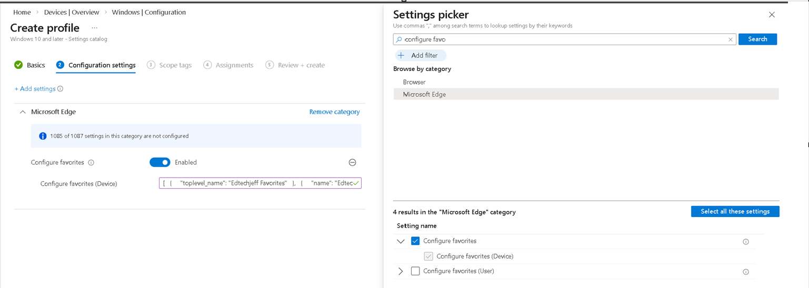
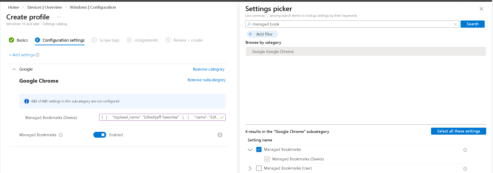
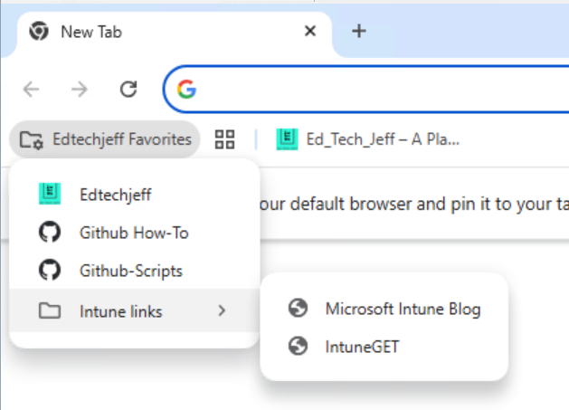

# Process to add bookmarks to Edge or Chrome via Intune

## Need a JSON file, below is an example

```json
[
  {
    "toplevel_name": "Edtechjeff Favorites"
  },
  {
    "name": "Edtechjeff",
    "url": "edtechjeff.com"
  },
  {
    "name": "Github How-To",
    "url": "https://github.com/edtechjeff/HowTo/tree/main/HowTo"
  },
    {
    "name": "Github-Scripts",
    "url": "https://github.com/edtechjeff/HowTo/tree/main/Scripts"
  },
  {
    "children": [
      {
        "name": "Microsoft Intune Blog",
        "url": "techcommunity.microsoft.com/category/microsoftintune/blog/microsoftintuneblog"
      },
      {
        "name": "IntuneGET",
        "url": "https://www.intuneget.com/"
      }
    ],
    "name": "Intune links"
  }
]
```

## Once you have your JSON file ready switch into Intune

- Windows > Devices > Configuration > New Policy

- Platform: Windows 10 and later
- Profile type: Settings catalog
- Name: Bookmarks
- Description: Add managed bookmarks to browser

## Click on Add Settings
***Note:Edge you will search for Configure favorites***

***Note:Chrome you will search for Managed Bookmarks***



## Add the setting either for Edge or Chrome

## Enable the settings

## Paste the json in the box

## Once updated and clients checked in verify its working
