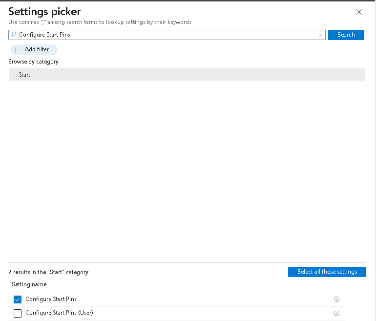
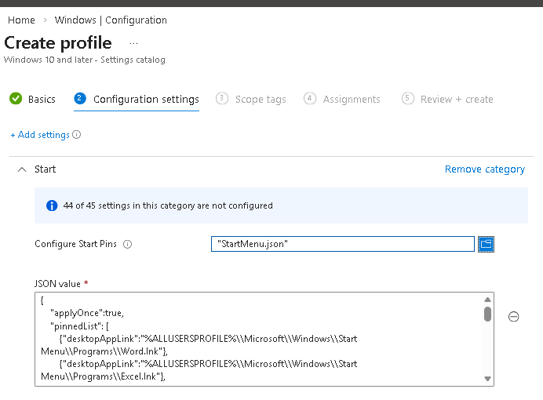
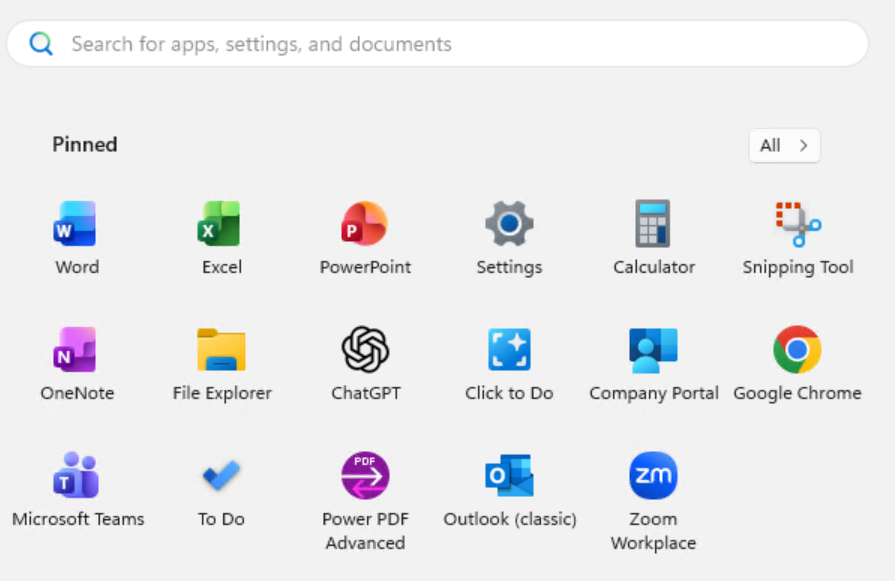

    ---
    title: Custom Pinned Start Menu  
    author: Jeff Downs
    date: 02/11/2026
    ---

# Process to setup custom Start Menu

## The start menu is very easy to configure. The best method is to take machine and first pin any applications or shortcuts that you want to be pushed out to your clients

- Next step is to export the JSON
- Run the following powershell command

```powershell
Export-StartLayout -Path "C:\temp\StartMenuLayout.json"
```

The exported JSON will look like the following. ***Note:the applyOnce section was added to the exported JSON***

### "applyOnce":true is a newer feature that allows this to apply once to the start menu then users can add to this. If set to false users can stil customize but it will change back to this list after every Intune sync. 

```json
{
    "applyOnce":true,
    "pinnedList": [
	{"desktopAppLink":"%ALLUSERSPROFILE%\\Microsoft\\Windows\\Start Menu\\Programs\\Word.lnk"},
	{"desktopAppLink":"%ALLUSERSPROFILE%\\Microsoft\\Windows\\Start Menu\\Programs\\Excel.lnk"},
	{"desktopAppLink":"%ALLUSERSPROFILE%\\Microsoft\\Windows\\Start Menu\\Programs\\PowerPoint.lnk"},
    {"packagedAppId":"windows.immersivecontrolpanel_cw5n1h2txyewy!microsoft.windows.immersivecontrolpanel"},
    {"packagedAppId":"Microsoft.WindowsCalculator_8wekyb3d8bbwe!App"},
    {"packagedAppId":"Microsoft.ScreenSketch_8wekyb3d8bbwe!App"},
    {"desktopAppLink":"%ALLUSERSPROFILE%\\Microsoft\\Windows\\Start Menu\\Programs\\OneNote.lnk"},
    {"desktopAppLink":"%APPDATA%\\Microsoft\\Windows\\Start Menu\\Programs\\File Explorer.lnk"},
    {"packagedAppId":"OpenAI.ChatGPT-Desktop_2p2nqsd0c76g0!ChatGPT"},
    {"packagedAppId":"MicrosoftWindows.Client.CoreAI_cw5n1h2txyewy!ClickToDoApp"},
    {"packagedAppId":"Microsoft.CompanyPortal_8wekyb3d8bbwe!App"},
    {"desktopAppLink":"%ALLUSERSPROFILE%\\Microsoft\\Windows\\Start Menu\\Programs\\Google Chrome.lnk"},
    {"packagedAppId":"MSTeams_8wekyb3d8bbwe!MSTeams"},
    {"packagedAppId":"Microsoft.Todos_8wekyb3d8bbwe!App"},
    {"desktopAppLink":"%ALLUSERSPROFILE%\\Microsoft\\Windows\\Start Menu\\Programs\\Nuance Power PDF Advanced\\Power PDF Advanced.lnk"},
    {"desktopAppLink":"%ALLUSERSPROFILE%\\Microsoft\\Windows\\Start Menu\\Programs\\Outlook (classic).lnk"},
    {"desktopAppLink":"%ALLUSERSPROFILE%\\Microsoft\\Windows\\Start Menu\\Programs\\Zoom\\Zoom Workplace.lnk"}
    ]
}
```

- You now have you what you need to create the policy, Switch over to Intune

- Devices > Windows > Configuration > New Policy

    - Platform: Windows 10 and later
    - Profile type: Settings Catalog
    - Name: Start Menu
    - Description: Standard Start Menu

- Click Create

- Name: Start Menu
- Description: Standard start menu for users

- Click Next

- Click on Add Settings

- Search for "Configure Start Pins"
***Note:This setting has 2 options either User or Device. Choose which ever one is appropriate for your application***



On the left of the screen click on the Select a file and find your JSON file



- Click Next, Next

- Assign to the correct User or Device group depending on what you selected earlier, and click next, Create

- Wait for the policy to sync with devices

