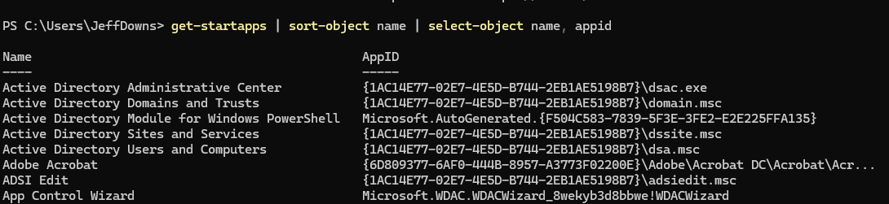
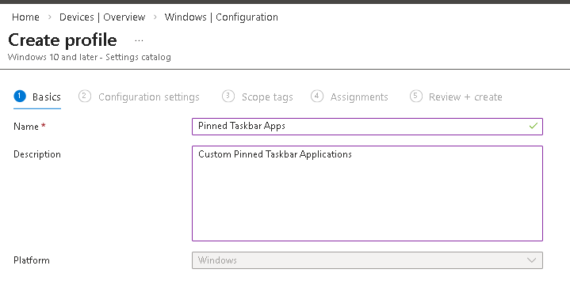
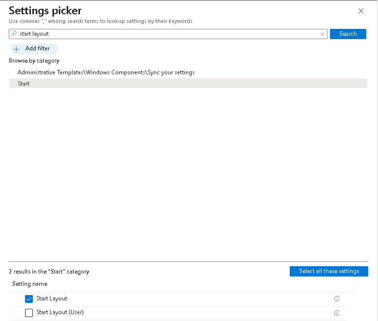
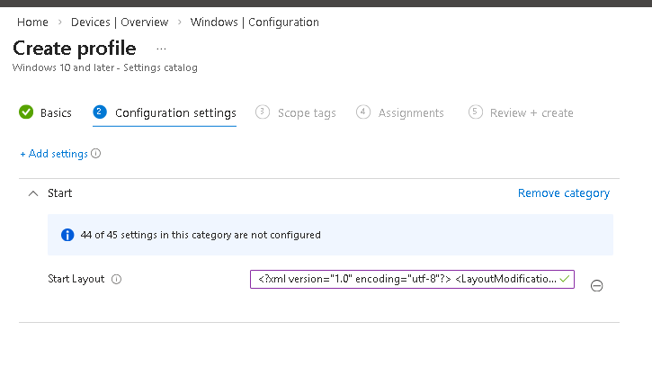
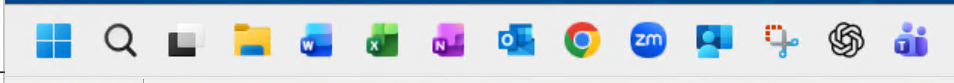

    ---
    title: Custom Pinned Taskbar  
    author: Jeff Downs
    date: 02/11/2026
    ---

# How to Pin taskbar items via Intune

## This process is pretty straight forward. The most difficult part is to figure out what apps you want deployed and what info. 

- Gather a list of applications that are installed on your device
***note:This will display all your installed applications. Needed to gather the info

```powershell
get-startapps | sort-object name | select-object name, appid
```



Take note of the AppID field for the corresponding application you would like to pin

The following XML can be used as a template

```xml
<?xml version="1.0" encoding="utf-8"?>
<LayoutModificationTemplate
    xmlns="http://schemas.microsoft.com/Start/2014/LayoutModification"
    xmlns:defaultlayout="http://schemas.microsoft.com/Start/2014/FullDefaultLayout"
    xmlns:start="http://schemas.microsoft.com/Start/2014/StartLayout"
    xmlns:taskbar="http://schemas.microsoft.com/Start/2014/TaskbarLayout"
    Version="1">
  <CustomTaskbarLayoutCollection PinListPlacement="Replace">
    <defaultlayout:TaskbarLayout>
      <taskbar:TaskbarPinList>
        <taskbar:UWA AppUserModelID="Microsoft.CompanyPortal_8wekyb3d8bbwe!App" PinGeneration="2" />
        <taskbar:UWA AppUserModelID="Microsoft.ScreenSketch_8wekyb3d8bbwe!App" PinGeneration="2" />
        <taskbar:DesktopApp DesktopApplicationID="Chrome" PinGeneration="2" />
        <taskbar:DesktopApp DesktopApplicationID="Microsoft.Windows.Explorer" PinGeneration="2" />
        <taskbar:DesktopApp DesktopApplicationID="Microsoft.Office.OUTLOOK.EXE.15" PinGeneration="2" />
        <taskbar:UWA AppUserModelID="OpenAI.ChatGPT-Desktop_2p2nqsd0c76g0!ChatGPT" PinGeneration="2" />
        <taskbar:DesktopApp DesktopApplicationID="Microsoft.Office.EXCEL.EXE.15" PinGeneration="2" />
        <taskbar:UWA AppUserModelID="MSTeams_8wekyb3d8bbwe!MSTeams" PinGeneration="2" />
        <taskbar:DesktopApp DesktopApplicationID="Microsoft.Office.ONENOTE.EXE.15" PinGeneration="2" />
        <taskbar:DesktopApp DesktopApplicationID="Microsoft.Office.WINWORD.EXE.15" PinGeneration="2" />
        <taskbar:DesktopApp  DesktopApplicationID="zoom.us.Zoom Video Meetings"  PinGeneration="2" />
      </taskbar:TaskbarPinList>
    </defaultlayout:TaskbarLayout>
  </CustomTaskbarLayoutCollection>
</LayoutModificationTemplate>

```

## Details about the XML document:

- This section dictates if you are going to add or replace. If you omit this section it will add to the list
```xml
<CustomTaskbarLayoutCollection PinListPlacement="Replace">
```

- PinGeneration if set to 1 will only apply 1 time and if the user removes the pinned application it will not come back. Setting the number higher IE 2 will make it apply every time
```xml
PinGeneration="2"
```

- UWA verus DesktopApp
    - UWA pins are for packaged apps and require the app’s AUMID (PackageFamilyName!AppId).

    - DesktopApp pins are for classic Win32 apps and require a desktop app identifier that Windows can resolve (or, more reliably, a managed .lnk shortcut pinned via a supported method).

- Once you have your XML created switch over to Intune

Devices > Windows > Configuration > New Policy

Platform : Windows 10 and later
Profile type: Settings Catalog


Name: Pinned Taskbar Apps
Description: Custom Pinned Taskbar Applications



Click Next

click add settings and search for Start Layout
***Note: You have 2 options either Device or User***


On the left side of the screen copy and past your XML into the box



Click Next > Next

Under Assignments assign to either the devices or group that you wish to apply it to

Click Next and Create

Once the configuration policy has been pushed out the taskbar will be replaced


