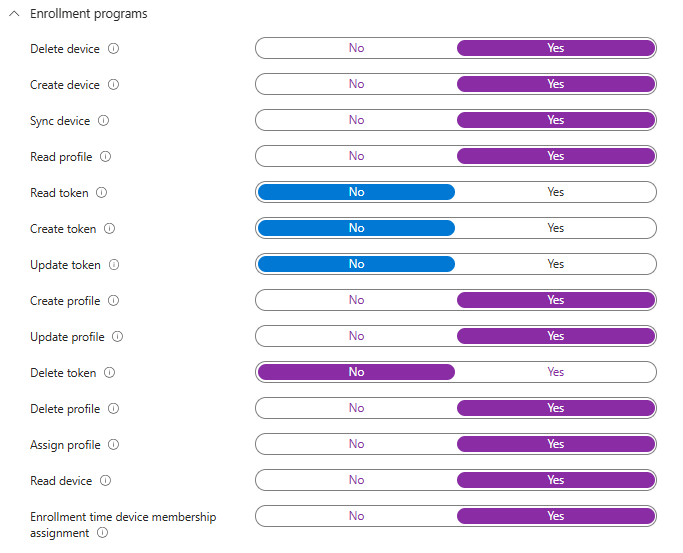

# Creation of AutoPilot Enrollment Account

## In the following How-To we are going to be creating a custom role that will enable a non-admin account that can enroll devices into AutoPilot. 

## Items you will need to have created before we begin

1. Security Group for the user or users
2. Account that has a microsoft Intune LIC assigned to it

***Note: Permissions Not Needed***
- Get enrollment token
- Create enrollment token
- Delete enrollment token
- Update enrollment token

1. Create security role
 - Go to the Intune Portal
 - Tenant Administration
 - Roles
 - Create
 
 - Give is a name and description
 - On the permissions tab scroll down till you see ***Enrollment Programs*** expand it
    - Slide over all to yes except for the ones named above as not needed
    
 - Click next
 - Click Create
2. Assign the role to your security Group
 - Click on the role you just created
 - Click on Assignments
 - Click on Assign
 - Give it a name and description and click Next
 - Click on add group and assign the security group that you created and added the user to and click next
 - Scope group click on Add All devices. ***This will enable that account to be able to manage all devices in your tenant for AutoPilot Enrollment*** Click Next
 - Click Next
 - Click Create

