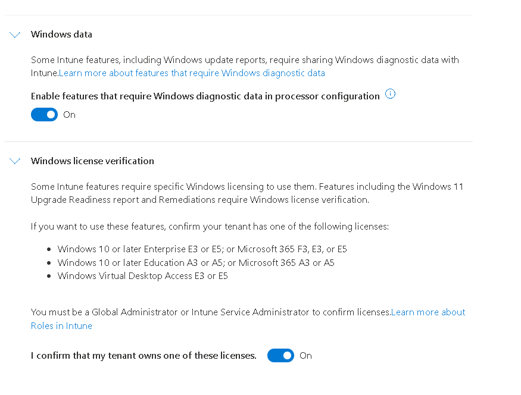
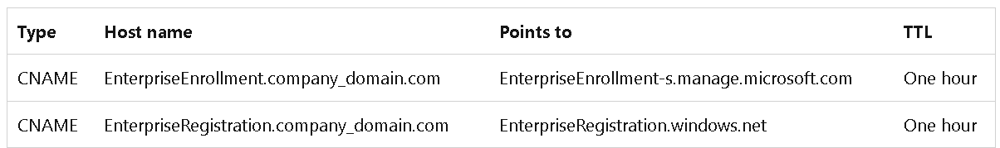
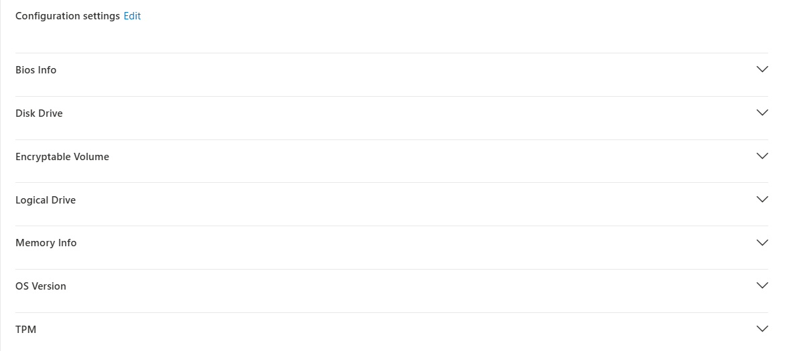
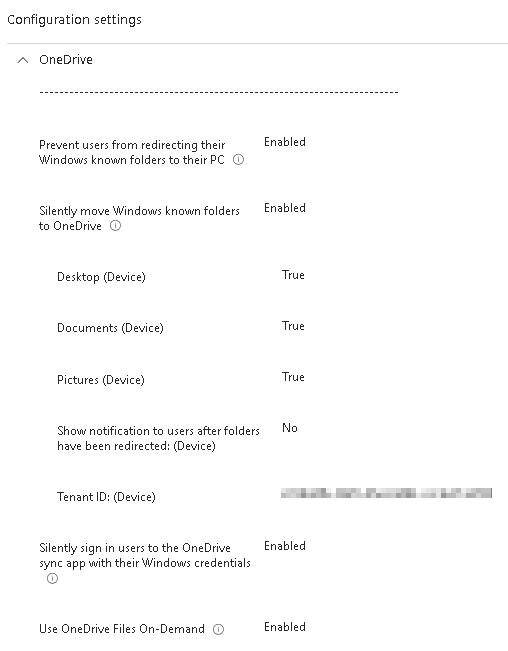

# Intune Setup
## ***Topics to cover during implmentation***

## Verify License Information

## Tenant Setup
***Settings to changed during setup***

- Enable Remediation Scripts
***Note: User must have a minumum of M365E3,F3,A3 in order to enable Remediation Scripts***



- Tenant Administration
    - Connectors and Tokens
        - Windows Data

## Groups Naming Convention


## Dynamic Groups
***Note: Instead of using Dynamic Groups you could also use Assignment Filters***

### AutoPilot Device
```
(device.devicePhysicalIDs -any (_ -startsWith "[ZTDid]"))
```

### Devies that are MDM,Company Owned, Hybrid Joined
```
(device.managementType -eq "MDM") and (device.deviceOwnership -eq "Company") and (device.deviceTrustType -eq "ServerAD")
```

### Devices that are MDM, Company Owned, EntraID Joined
```
(device.managementType -eq "MDM") and (device.deviceOwnership -eq "Company") and (device.deviceTrustType -eq "AzureAD")
```
---

### Devices that have a specific Group Tag
```
(device.devicePhysicalIds -any _ -eq "[OrderID]:StaffDevice") 
```

### Devices that have a PurchaseOrder
```
(device.devicePhysicalIds -any _ -eq "[PurchaseOrderId]:0123456789")
```


## Windows Enrollment Settings

- Devices
    - Windows
        - Enrollment
            - Automatic Enrollment
                ***Verify that all the URLs are populated if not click on Restore Default MDM URLS***
                ***Adjust scope to all users or specific users that you would like to enable for MDM enrollment***
            - CNAME Validation
                ***Verify that public DNS records have been setup***
                [Setup DNS for AutoEnrollment][https://learn.microsoft.com/en-us/intune/intune-service/enrollment/windows-enrollment-create-cname#step-1-create-cname]
                        
            - Check properties of Enroolment restrictions
            - Check properties of Enrollment device limit restrictions
                ***Default is 5***
            - Windows Hello
                ***Discuss if want on or disabled***
                ***Note:This is a Tenant level configuration. If you want to have on or off for some best to use configuration files***
        - Device Enrollment Managers
            ***Used for enrollment account for mass deployments***
            ***Must have a valid Intune LIC***
            ***Can only enroll up to 1000 devcies at one time***
  


## Configuration Policies

### Default Entra Domain

Platform: Windows 10 or Later

Profile Type: Settings Catalog


---

### Time Zone

Platform: Windows 10 or Later

Profile Type: Settings Catalog


---

### Delivery Optimization

Platform: Windows 10 or Later

Profile Type: Settings Catalog


---

### System Resources

Platform: Windows 10 or Later

Profile Type: Settings Catalog



---

### One Drive Auto Setup

---
Platform: Windows 10 or Later

Profile Type: Settings Catalog



## Compliance Policies
- Create default policy and apply to all devices
    ***Does not have to have any settings just needs to be assigned to all devices for them to be compliant***

## Assignment Filters
- Create filters based on required groups
    - Type: Managed Devices
    - Platform: Windows 10 and Later

## Apps
- [Win32PrepTool][https://github.com/Microsoft/Microsoft-Win32-Content-Prep-Tool]
    ***Note:Tools is from Microsoft, not 3rd party tool***