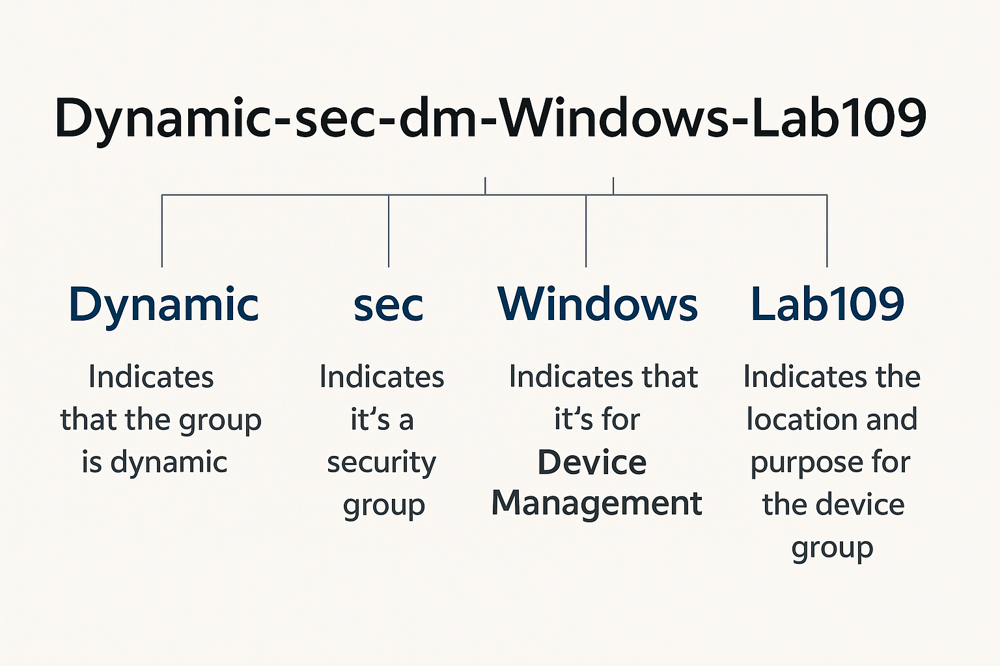
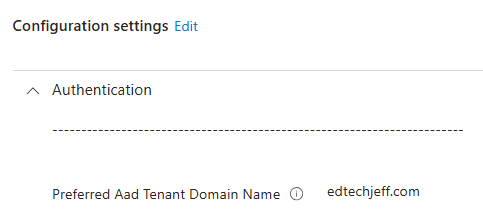
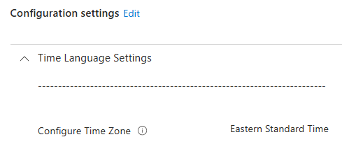
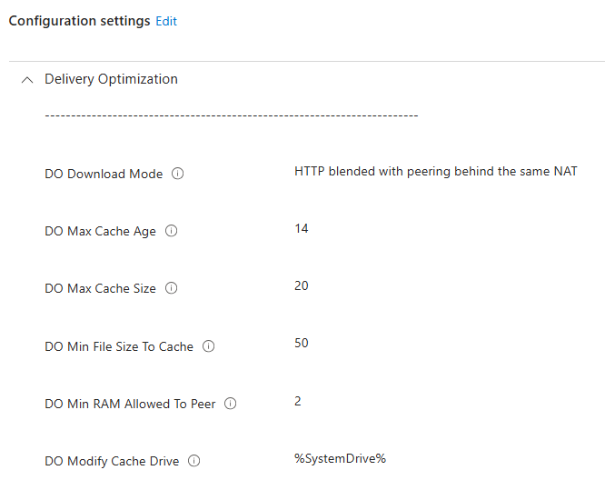

# Intune Setup
## ***Topics I cover during implmentation***

## Groups Naming Convention


## Dynamic Groups

### AutoPilot Device
```
(device.devicePhysicalIDs -any (_ -startsWith "[ZTDid]"))
```

### Devies that are MDM,Company Owned, Hybrid Joined
```
(device.managementType -eq "MDM") and (device.deviceOwnership -eq "Company") and (device.deviceTrustType -eq "ServerAD")
```

### Devices that are MDM, Company Owned, EntraID Joined
```
(device.managementType -eq "MDM") and (device.deviceOwnership -eq "Company") and (device.deviceTrustType -eq "AzureAD")
```
---

## Policies

### Default Entra Domain



---

### Time Zone



---

### Delivery Optimization

