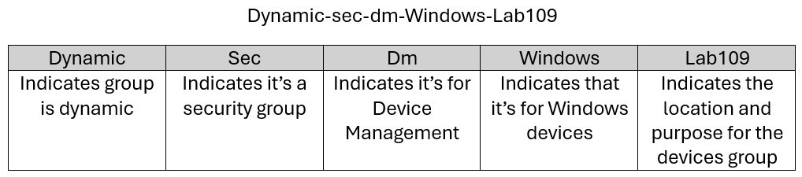

# Intune Setup
> **Note:** Topics to cover during implementation

- Verify license Information

## Tenant Setup
> **Note:** Settings to be changed during setup

- Enable Remediation Scripts

> **Note:** User must have a minimum of M365E3,F3,A3 in order to enable Remediation Scripts

- Tenant Administration
    - Connectors and Tokens
        - Windows Data

{ width=90% }

---

## Groups Naming Convention


## Dynamic Groups
> **Note:** Instead of using Dynamic Groups you could also use Assignment Filters

###  AutoPilot Device
```
(device.devicePhysicalIDs -any (_ -startsWith "[ZTDid]"))
```

### Devices that are MDM,Company Owned, Hybrid Joined
```
(device.managementType -eq "MDM") and (device.deviceOwnership -eq "Company") and (device.deviceTrustType -eq "ServerAD")
```

### Devices that are MDM, Company Owned, EntraID Joined
```
(device.managementType -eq "MDM") and (device.deviceOwnership -eq "Company") and (device.deviceTrustType -eq "AzureAD")
```

### Devices that have a specific Group Tag
```
(device.devicePhysicalIds -any _ -eq "[OrderID]:StaffDevice") 
```

### Devices that have a PurchaseOrder
```
(device.devicePhysicalIds -any _ -eq "[PurchaseOrderId]:0123456789")
```

---

## Assignment Filters
- Create filters based on required groups
    - Type: Managed Devices
    - Platform: Windows 10 and Later

---

## Windows Enrollment Settings

- Devices
    - Windows
        - Enrollment

### Automatic Enrollment

> **Note:** Verify that all the URLs are populated if not click on Restore Default MDM URLs

> **Note:** Adjust scope to all users or specific users that you would like to enable for MDM enrollment

---

### CNAME Validation

> **Note:** Verify that public DNS records have been setup

[Setup DNS for AutoEnrollment](https://learn.microsoft.com/en-us/intune/intune-service/enrollment/windows-enrollment-create-cname#step-1-create-cname)


---

### Check properties of Enrollment restrictions

---

### Check properties of Enrollment device limit restrictions
> **Note:** Default is 5

---

### Windows Hello
> **Note:** Discuss whether this should be enabled or disabled. This is a tenant-level configuration.

---

### Device Enrollment Managers
    - Used for enrollment account for mass deployments
    - Must have a valid Intune license
    - Can only enroll up to 1000 devices at one time

---

## Configuration Policies

### Default Entra Domain

Platform: Windows 10 or Later

Profile Type: Settings Catalog


---

### Time Zone

Platform: Windows 10 or Later

Profile Type: Settings Catalog


---

### Delivery Optimization

Platform: Windows 10 or Later

Profile Type: Settings Catalog


---

### System Resources

Platform: Windows 10 or Later

Profile Type: Settings Catalog


---

### One Drive Auto Setup

---

Platform: Windows 10 or Later

Profile Type: Settings Catalog


---

## Compliance Policies
- Create default policies and apply to all devices

> **Note:** Does not have to have any settings just needs to be assigned to all devices for them to be compliant

---

## Apps

[Win32PrepTool](https://github.com/Microsoft/Microsoft-Win32-Content-Prep-Tool)
> **Note:** Tool is from Microsoft, not 3rd party tool