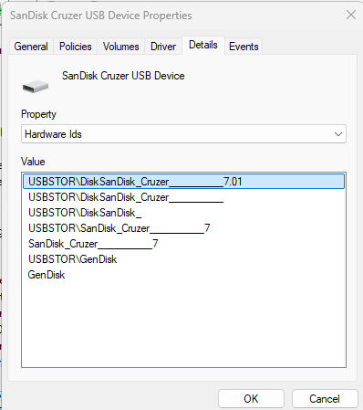
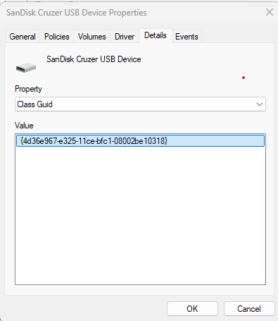
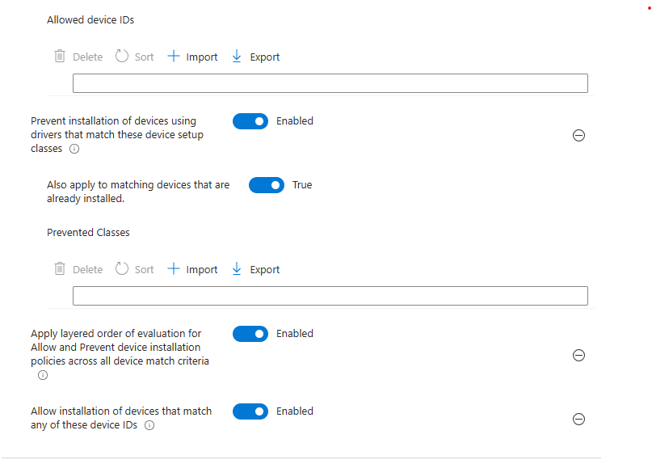
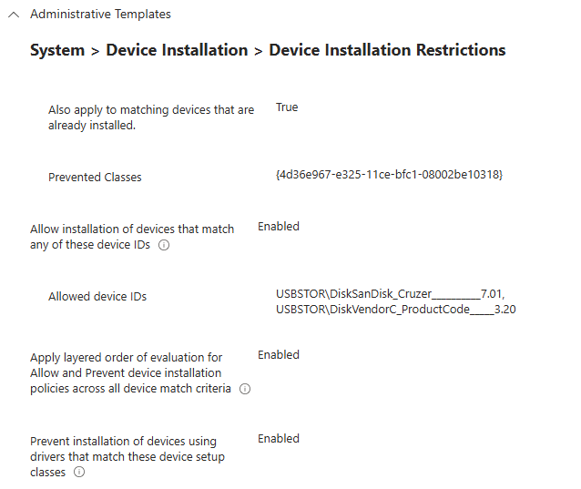

# Allow USB Thumb Drives while restricting others

- Plug in your Thumb Drive
- Opne up device manager
- Expand Disk Drives
- Right click on the thumb drive and click properties
- Click on the Details tab
- At the dropdown menu find the Hardware Ids
    - Copy the first line and save in notepad or something

- Next change the drop down and find the Class Guid
    ***Note: You only need to do this Class Guid ID one time further down the config. All USB's thumb drives use the same Class Guid***
    - copy the whole line and save in notepad or something

- Open up the Intune Portal
- Go to Devices > Windows > Configuration and click on create new policy
    - Platform  - Windows 10 and Later
    - Profile Type  - Settings Catalog
    - Name: Allow USB Drives
    - Description: Policy to enable the use of specific USB drives
- Click Create
- Click on Add Settings
- Find the following settings
    - Allow installation of devices that match any of these device IDs
    - Apply layered order of evaluation for Allow and Prevent device installation policies across all device match criteria
    - Prevent installation of devices using drivers that match these device setup classes
        - ***Note: I will state for the record the last one honestly sounds like it will block them, but it does not when used in conjunction with the Apply Layered and Allow Installations.***
- At this point your policy should look like the following
    ***Important:Enable all the settings and also make sure you set "Also apply to matching devices that already installed" Set that to True***

- From your gathered information your policy now filled in with the Hard IDs and also the Class Guid should look something like the following
- Click next
- Click next, unless you want to use scope tags
- Add the assignements to the desired device group
- Click on Create

USBSTOR\DiskSanDisk_Cruzer__________7.01
{4d36e967-e325-11ce-bfc1-08002be10318}

