# Using RClone to map drive to SharePoint or OneDrive

## In this article we are going to talk about RClone. What is RClone? RClone is a command-line tool for managing and syncing files across various cloud storage providers, including Google Drive, OneDrive, AWS S3, and more. It supports advanced features like encryption, deduplication, and bandwidth throttling, making it a powerful alternative to traditional cloud sync tools. RClone is widely used for backups, migrations, and automation due to its flexibility and scripting capabilities.

In order to get this working you will need the following required software packages

## Required Software

- https://rclone.org/downloads/
- https://winfsp.dev/rel/

1. Once you get that downloaded, extract the RClone to your local device. Rename the folder to just RClone
2. Now that you have RClone downloaded, I would suggest for easier management to add the exe to your systems folder path so its easier to call it out from the command-line.
3. Next install winfsp, just accept the defaults

Now you have the pre-requisites setup

4. bring up a command prompt. In this example we are going to map to a users onedrive folder, but first we must configure it. Run the following command

```
rclone config
```

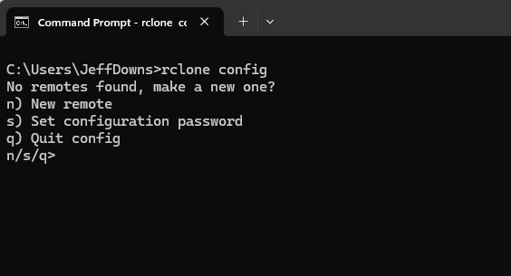

5. Type N for New remote and give it a name. Pay attention to the name the command we will use later is Case Sensitive

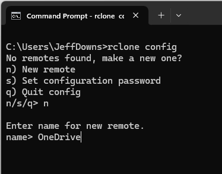

6. Now you will be presented with a list of cloud sources. Scroll through the list and find OneDrive. For this example 36 will be what we are looking for. 

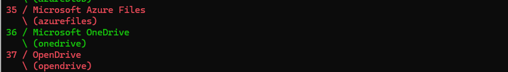

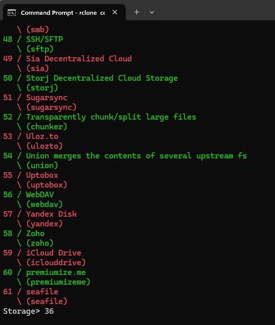

7. In this example we are going to be using our M365 credentials to log onto our OneDrive. It is optional to setup an enterprise application, but for us just press enter

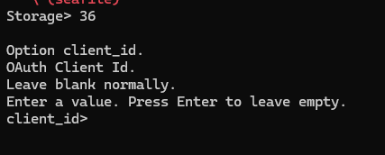

8. Press enter again

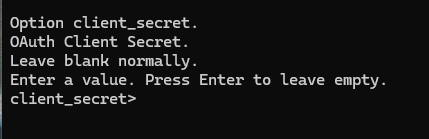

9. Now select your region

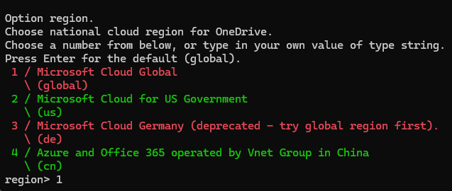

10. Again, just press enter

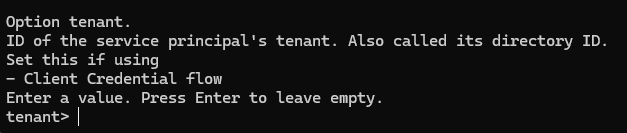

11. Again, just press enter

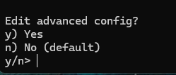

12. Again, just press enter

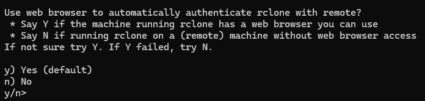

13. In another window, it will log you on with your M365 credentials. 

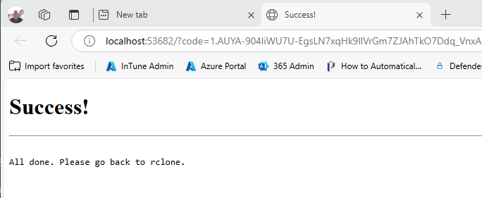

14. Now select option 1 for Onedrive. Notice at this point you can also do sharepoint

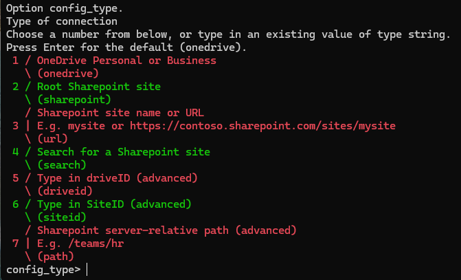 

15. At this point you will be presented with what you want to connect to. In my example I have 2. I am going to connect to option 2

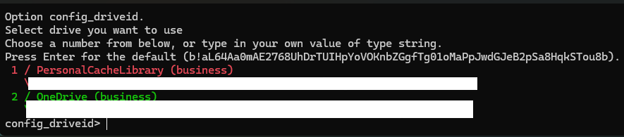 

16. Just press enter to accept the defaults

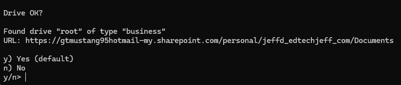

17. It will create a token at this point and show you the token. Just accept the defaults

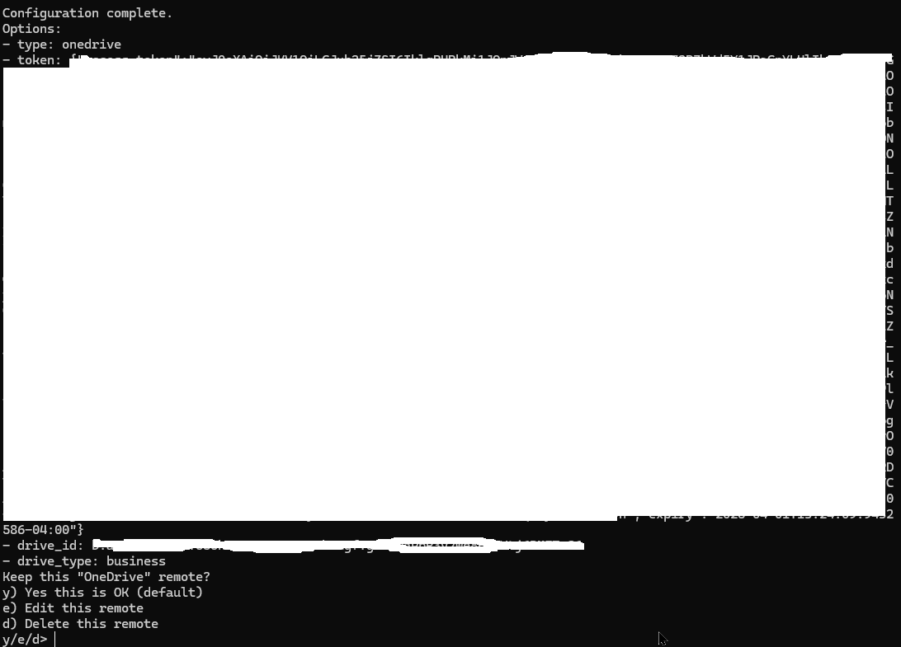

18. Now you see you have configured the connection

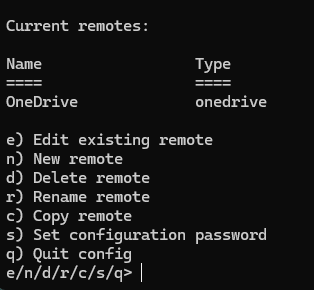

19. Press q and enter to quit

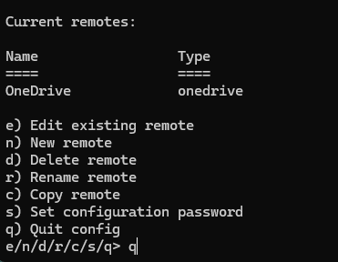

19. Now you can run the following command to map to OneDrive. 

```
rclone --vfs-cache-mode writes mount sharepoint: *
```


## Command to Mount SharePoint 


## Command (Example of copying file from D drive on local machine to Z drive the mounted SharePoint folder)

```
rclone copy D:\ Z:\ --fast-list --progress --create-empty-src-dirs
```


