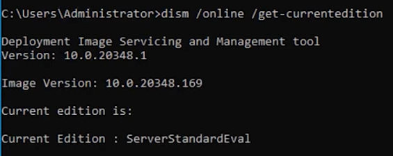

# 🔄 Convert a Windows OS Trial to Full Version

This guide explains how to convert a trial version of Windows Server to a fully licensed version using DISM.

---

## 📝 Step-by-Step Instructions

### 1. Check Current Edition

Run the following command in Command Prompt (Admin):

```bash
dism /online /get-currentedition
```



---

### 2. Check Target Editions Available for Upgrade

```bash
dism /online /get-targeteditions
```

This will show the editions you can upgrade to from your current edition.


---

### 3. Set the New Edition and Enter Product Key

Replace `YOURPRODUCTKEY` with your actual product key:

```bash
dism /online /set-edition:serverstandard /productkey:YOURPRODUCTKEY /accepteula
```

- Make sure the edition (`serverstandard`) matches one of the target editions listed earlier.
- Use the correct syntax: `/accepteula` must be included.


---

### 4. Reboot the Server

After successful completion, **reboot the server** to finalize the upgrade.

---

## ⚠️ Notes

- Ensure your product key is valid for the target edition.
- This process is **irreversible**—make sure you're targeting the correct edition.
- Back up any critical data before proceeding with the conversion.